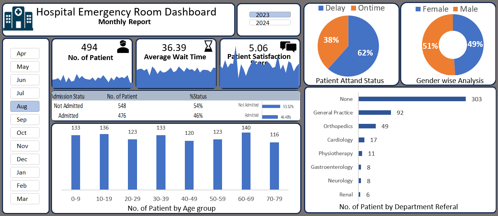

# 🏥Hospital Emergency Room Dashboard

## 📌Overview
An interactive Emergency Room(ER) Dashboard built using Microsoft Excel to analyze patient Flow, waiting time,admission trends, and department referrals.

## 🎯Objective
To monitor key ER performance metrics and identify operational insights for better decision-making.

## 🛠️Tools Used 
- Microsoft Excel 

- Pivot Tables & Charts

- Slicers (Month & Filter)

- KPI Cards

## 📊Key Metrics
- Total Patient

- Average Waiting Time

- Admission vs Not Admitted

- Age Group & Gender Distribution

- Department-wise Referrals

## Dashboard Preview

